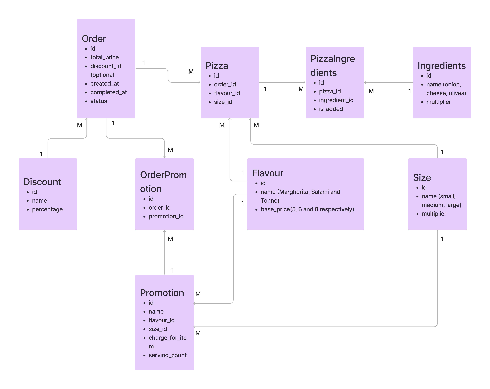

# Pizza Order Overview

This Rails project is a simple pizza order overview for a restaurant with minimal to no UI. It allows you to list all orders, view their details, mark orders as completed, and calculate the total price of a pizza order. It also supports the use of discount codes to reduce the invoice amount.

This app is just for the demo purpose and written from scratch by me (Azfar Syal).

## Installation and Setup

To get started with the project, follow the steps below:

1. Install Ruby on Rails (`using ruby 3.1.2`) on macOS using rbenv(`using rbenv 1.2.0`). You can refer to the following guide for detailed instructions: [How to Install Ruby on Rails with rbenv on macOS](https://www.digitalocean.com/community/tutorials/how-to-install-ruby-on-rails-with-rbenv-on-macos).

2. Set up Postgres (`using postgresql@13`) with Ruby on Rails on macOS. The guide at the following link will walk you through the process: [How to Use PostgreSQL with Your Ruby on Rails Application on macOS](https://www.digitalocean.com/community/tutorials/how-to-use-postgresql-with-your-ruby-on-rails-application-on-macos).

3. The project includes RuboCop for code linting. You can find RuboCop configuration files in the repository. To run RuboCop on the project, use the following commands:
   - Run RuboCop on all files:
        ```shell
        $ bundle exec rubocop
   - Run RuboCop on a specific file:
        ```shell
        $ bundle exec rubocop {filepath}
   - Automatically fix RuboCop offenses:
        ```shell
        $ bundle exec rubocop -a
4. Overcommit gem is also included to run RuboCop on Git commit. To set up Overcommit, use the following command:
   - Initialize Overcommit to run RuboCop on pre-commit:
        ```shell
        $ bundle exec overcommit --install
## Testing

- We are using rspec-rails for the purpose of testing. To execute test cases, run the following command:
   ```shell
   $ bundle exec rspec

## Project Description

This project is a pizza order overview application for a restaurant. It provides the following features:

- Order Listing: The application lists all orders with their respective items, details, and total prices at the homepage which is pointing to order index page i.e. `BASE_URL/order/`.
- Order Completion: Orders can be marked as completed by clicking the corresponding button. A PATCH request is sent to the `/orders/:id` backend endpoint to update the order. Completed orders are no longer displayed in the UI.
- Pizza Order Calculation: The application calculates and displays the total price for a pizza order. Multiple pizzas can be ordered, and for each pizza, the desired size, special requests (extra ingredients and omit ingredients), and promotions codes as well as discount codes can be specified.
- Discount Codes: Discount codes allow for reductions in the total invoice amount by a percentage.

## Getting Started

To start the project, follow the steps below:

1. Run the following command to set up the database:

   ```shell
   $ rails db:setup
2. Run the following command to start the rails server
    ```shell
    $ rails s
Now you can acess the project locally at `http://localhost:3000/`

## Database Schema
Following diagram show the Database Tables and their relations (ERD) for this project:



## How to Create Order?

One way of creating order is through seed file as described below:

1. Define an object for an Order which will include all Pizza Items of an Order:
   - An order with single pizza item
      ```shell
      order_1_items = [
         { "flavour": "tonno", "size": "large" },
      ]
   - An order with multiple pizza items, also have option to add or remove ingreditems from pizza:
      ```shell
      order_2_items = [
         { "flavour": "margherita", "size": "large",
            "add": ["onions", "cheese"],
            "remove": ["olives"],
         },
         { "flavour": "salami", "size": "small",
            "remove": ["onions", "olives"],
         },
         { 
            "flavour": "salami", "size": "small"
         },
         { "flavour": "margherita", "size": "small", }
      ]
2. Use the object define in previous step to call a service class i.e OrderService::CreateOrder which will validate input fields and then will create the order.
   - OrderService::CreateOrder will accept following paramters
      ```shell
      1. status:
         - optional
         - type: string/symbol
         - Possible Values: 'pending' (default) or 'completed'
      2. items
         - required
         - type: Array of pizza item objects.
            - For each Pizza Item: Available/Valid 'flavour' and 'size' value must be given.
         - Possible values as defined in the First Step above for Pizza Items
      3. promotion_codes
         - optional
         - type: Array of comma separated valid promotion codes (string)
         - Possible Values: [] (default) or ["2for1-salami-small"]
      4. discount_code
         - optional
         - type: Valid discount code (string)
         - Possible Values: nil (default) or "saves5" or "saves20"
   - Call the OrderService::CreateOrder class to create an other, for example:
      ```shell
      OrderService::CreateOrder.new(items: order_1_items).call
      OrderService::CreateOrder.new(items: order_2_items, promotion_codes: ['2for1-salami-small'], discount_code: 'saves5').call
3. Now close the rail serve (if running already) then run the following command to update the database from seed file:

   ```shell
   $ rails db:seed
4. Available Values as of existing seed file, for above given parameters:

   ```shell
      - flavour: 
         - 'margherita' (base_price: 5)
         - 'salami' (base_price: 6)
         - 'tonno' (base_price: 8)
      - size to add/remove:
         - 'small' (multiplier: 0.7)
         - 'medium' (multiplier: 1)
         - 'large' (multiplier: 1.3)
      - ingredients to add/remove:
         - 'onions' (multiplier: 1)
         - 'cheese' (multiplier: 2)
         - 'olives' (multiplier: 2.5)
      - discount:
         - 'saves5', 'saves10' and 'saves25'
      - promotions:
         - '2for1-salami-small'

